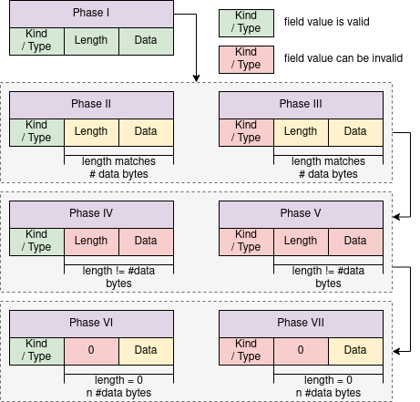
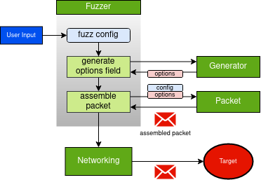

# SNF

### Simple Network Fuzzer

... is a very simple TCP and IP options fuzzer.

A typical TCP packet consists of a 20 bytes header. In some cases, TCP options are added, increasing the header length by 32-bit words to a maximum of 40 bytes of options. Thus, the TCP header size grows to a total of 60 bytes. There are various possible options with a predefined structure: https://www.iana.org/assignments/tcp-parameters/tcp-parameters.xhtml

In principle, the same applies to IP, where options can be added to the IP header.

With regards to TCP and IP options, several vulnerabilities have been uncovered, for example:

**CVE-2020-24337** *An issue was discovered in picoTCP and picoTCP-NG through 1.7.0. When an unsupported TCP option with zero length is provided in an incoming TCP packet, it is possible to cause a Denial-of-Service by achieving an infinite loop in the code that parses TCP options, aka tcp\_parse\_options() in pico_tcp.c.*

**CVE-2017-5970** *The ipv4\_pktinfo\_prepare function in net/ipv4/ip_sockglue.c in the Linux kernel through 4.9.9 allows attackers to cause a denial of service (system crash) via (1) an application that makes crafted system calls or possibly (2) IPv4 traffic with invalid IP options.*

SNF aims to detect issues regarding TCP and IP options by fuzzing the option fields of TCP and IP packets. To achieve this, SNF operates either in the *TCP options fuzzing mode* or the *IP options fuzzing mode*.

For TCP and IP options fuzzing, the following workflow is applied:


## Dependencies

all you need is `cmake` and `ninja-tools`.

```
# Ubuntu/Debian
sudo apt-get install cmake ninja-tools
```

... and to recursively clone this repo to get unity
if you intend to do unit testing.

## Building

first step:

```
cd src
cmake -GNinja CMakeLists.txt
chmod +x build
```

building the release:

```
cd src
./build release
```

building the tests:

```
cd src
./build test
```

running tests:

```
cd src
ctest -VV
```

clean the project:

```
cd src
./build clean
```

## Fuzzing

To fuzz with SNF, do the following:

```
./snf -t [TARGET IP] -p [TARGET PORT] -i [INTERFACE NAME] -m [MODE]    
# mode is either 0 for IP options or 1 for TCP options fuzzing
```

## Structure

The `src` folder contains the source code and the means to build.
It is structured as follows:

```
- `modules` contains the individual code modules
- `tests` contains the unit tests for the code modules
- `main` contains the main.c file for the release build
- `external` contains any external code
- `global` contains global headers, configs, etc. 
```

For SNF, the modules are structured in the following way:



The fuzzer module controls all fuzzing. It receives a fuzz 
configuration from the user, supplied via the command line
arguments from main. Next, the generator entity is invoked, which 
generates an options field (TCP or IP). This field, along
with the configuration, is passed to the packet module. Here,
a full packet is assembled from the information passed in.
The fuzzer receives the packet buffer, which is then sent
to the target utilizing the networking module.

For each phase described above, the variable TCP_INVALID_COUNT
(IP_INVALID_COUNT respectively) controls how many packets are 
sent per phase. These values are currently both defined in generator.c.

## Documentation

doc contains documentation for SNF, currently only the 
image used in this readme. Most of the documentation is
inline.

### 0xca7
